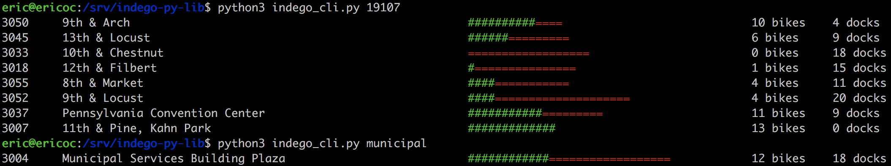

Command-line script
--------------------

The included [`indego_cli.py` script](indego_cli.py) is a fun command-line Python script that I wrote which uses the `Indego` class/library to get the bike share data from the A$

